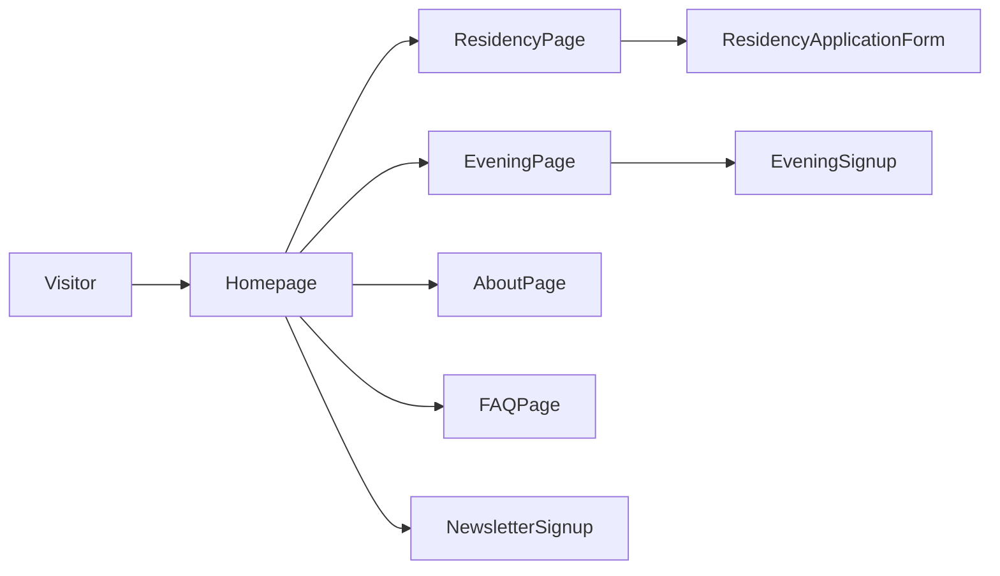

## Habitat Website Rebuild Plan

### 1. Positioning & narrative

- **Core story**: Combine the immediacy of “launch a startup in one evening” with a longer arc around your new residency (Habitat as the place where ambitious people go from idea → prototype → residency → real company).
- **Inspiration mapping**:
  - From `solofounders.com`: strong editorial voice, manifesto-style sections, and residency as a central pillar.
  - From `ycombinator.com`: social proof with well-structured success stories and clear “YC turns builders into formidable founders” framing.
  - From `join-thebridge.com`: ultra-clear promise + who-it’s-for + program details + investment/portfolio credibility.
- **Key messaging blocks**:
  - One-sentence promise (hero): e.g. “Launch and grow your startup in Leuven – from one evening to a full residency.”
  - Sub-headline: clarify that you arrive with an idea and leave with prototype, landing page, and people to talk to – plus a path into residency.
  - 3–4 value pillars: Testing beats planning, Community compounds, Low-stakes, high-signal, plus “Residency momentum”.
  - Residency-specific pitch: what it is, who it’s for, and what founders get that they can’t get alone.

### 2. Site architecture & pages

- **Homepage (`/`)**
  - Hero: Big, YC-style headline; subcopy; primary CTA (Apply to Residency / Join Residency Waitlist) and secondary CTA (Join a Habitat Evening).
  - Trust row: logos or text for cities/participants/partners, and concise social proof counters (participants, prototypes launched, NPS/recommends).
  - “Why Habitat” section: refine the existing “Testing beats planning / Community compounds / Low stakes, high signal” with clearer one-liner and 1–2 sentence explanations.
  - “Path at Habitat” section: simple timeline from evening → first users → residency → company; visually similar to YC’s “during YC / now” flow.
  - Testimonials: reformat into card layout with photo (if available), name, role, 1–2 line quote; optionally add mini case-study links.
  - Snapshot of Residency: short teaser with link to full Residency page.
  - FAQ preview: 3–4 top questions, link to full FAQ page.
- **Residency page (`/residency`)**
  - Hero: “Residency in Leuven” (or your chosen label) with clear statement: duration, who it’s for, what they leave with.
  - “Who this is for”: bullet list styled like The Bridge – pre-idea, early traction, non-technical founders, people working full-time but serious about building, etc.
  - “What you get”: 
    - Structure: weeks/phases (e.g. Orientation, Build, Launch, Raise/Next steps).
    - Support: 1:1 mentorship, office hours, peer sessions, guests.
    - Environment: physical space, food, vibe.
    - Outcomes: prototype, customers, story, investor readiness.
  - “How it works” section (timeline): application → interview → decision → moving in → residency → demo/next steps.
  - “Backed by / signals” section: any notable partners, angels, or alumni outcomes; if not yet, frame as “built by founders for founders” with your own story.
  - Clear CTAs throughout: sticky or repeated “Apply to Residency” button leading to your form (Typeform, Tally, custom, etc.).
- **Evening program page (`/evening` or `/sprint`)**
  - Refine current content into a cleaner flow:
    - Hero: “Launch a startup in one evening.”
    - How the 5 hours work (hour-by-hour or phase-by-phase breakdown).
    - What you leave with: prototype, landing page, conversations for tomorrow.
    - Logistics: date/time, price (if any), location, what to bring.
    - FAQ tailored to the evening (coding, cofounders, idea stage).
- **About / Story page (`/about`)**
  - Simple origin story of Habitat (why Leuven, what problem you’re solving for builders).
  - Your bio and any co-organizers; short, YC-like framing (“we built Habitat to…”).
  - High-level vision: making it easier to start startups in Europe / Belgium.
- **FAQ page (`/faq`)**
  - Consolidate FAQ items from the current site plus new residency-specific questions.
  - Group in sections: “Residency”, “One-evening program”, “Practicalities” (location, visa, costs), “If I can’t code”, etc.
- **Blog / Resources (optional for v1) (`/blog`)**
  - Skeleton structure only at first: ability to publish essays similar in vibe to Solo Founders/YC (e.g. “Building a startup from Leuven”, “What we learned from 100+ people shipping in one evening”).

### 3. Visual & UX direction

- **Overall feel**: clean, confident, minimal – closer to Solo Founders + The Bridge than YC’s dense layout. Lots of white (or dark) space, one accent color.
- **Branding**:
  - Reuse or slightly modernize current Habitat brand (logo, main color) to avoid total reinvention.
  - Define a simple token set: `primary`, `accent`, `background`, `muted`, plus a single display font and a body font (Google Fonts or system stack).
- **Layout patterns**:
  - Reusable components: `Section`, `Container`, `Button`, `Stat`, `TestimonialCard`, `TimelineStep`, `FAQItem`.
  - Strong hierarchy on each page: clear above-the-fold story, then alternating sections with strong headings and short copy.
  - Responsive from the start: mobile-first stacks, then enhanced desktop layouts (2–3 column sections, side-by-side timelines).

### 4. Technical implementation

- **Stack recommendation** (assuming no constraints):
  - Use Next.js (App Router) + React + TypeScript for fast, SEO-friendly pages.
  - Use Tailwind CSS for rapid layout/theming and easy iteration on design.
  - Optionally use MDX or a headless CMS later for blog/resources; for v1, keep content in code/JSON.
- **Project structure (example)**:
  - `app/page.tsx` – Homepage.
  - `app/residency/page.tsx` – Residency page.
  - `app/evening/page.tsx` – One-evening program.
  - `app/about/page.tsx` – About.
  - `app/faq/page.tsx` – FAQ.
  - `app/layout.tsx` – Shared layout, navigation, footer.
  - `components/` – Shared UI components (Buttons, Sections, TestimonialCard, Timeline, FAQAccordion, etc.).
  - `content/` – Optional structured content objects (testimonials, FAQ entries, stats) to keep copy centralized.

### 5. Navigation, CTAs & flows

- **Global navigation**
  - Links: `Residency`, `Evening`, `About`, `FAQ` plus a highlighted `Apply` button.
  - On mobile: simple hamburger menu with sheet/drawer.
- **CTA strategy**
  - Primary CTA: `Apply to Residency` (or `Join Residency Waitlist` before applications open) pointing to your application form.
  - Secondary CTA: `Join a Habitat Evening` (if schedule exists) or `Get Notified` (email capture) for people not ready to commit.
  - Add email capture in the footer (newsletter/community updates) for long-term relationship building.

### 6. Content migration & upgrade

- **Reuse & improve**
  - Take your existing “Why join Habitat?” and testimonials and reframe into stronger headlines and tighter copy.
  - Turn numeric stats into a clean `Stats` strip (e.g. `200+ signed up this month`, `10+ participants per sprint`, `X prototypes launched`).
- **New copy requirements**
  - Residency overview (1–2 paragraphs) plus 3–5 key benefits.
  - Clear eligibility section (who should / shouldn’t apply).
  - A short founder story on the About page.
  - A short “How the evening works” breakdown.

### 7. Analytics & future experiments (high-level)

- **Tracking basics**
  - Add basic analytics (e.g. Plausible, Umami, or GA4) with event tracking for `Apply Residency`, `Join Evening`, `Newsletter signup`.
- **Future iteration hooks**
  - Design sections so they can be reordered or A/B tested later (e.g. testimonials higher vs lower, different hero copy) without structural changes.

### 8. Implementation phases

- **Phase 1 – Skeleton & routing**
  - Set up Next.js project with base layout, navigation, footer, and empty pages for all routes.
- **Phase 2 – Homepage & Residency**
  - Fully design and implement `/` and `/residency` with final-ish copy and responsive layout.
- **Phase 3 – Evening, About, FAQ**
  - Implement `/evening`, `/about`, `/faq` using shared components and refined copy from current site.
- **Phase 4 – Polish & performance**
  - Tune spacing, typography, SEO (meta tags, Open Graph, structured titles/descriptions), and add analytics.

To visualize the high-level user flow:

