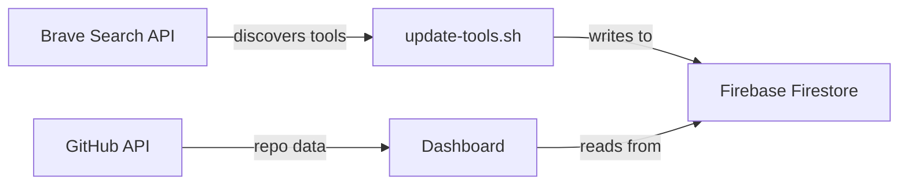

# Live Data Integration — Firebase + Brave Search API

## Goal

Make the Builder's Toolkit data always fresh by:
1. **Firebase Firestore** — cloud database to store & serve tool data (no hardcoded lists)
2. **Brave Search API** — discover new tools, update descriptions, check relevance

## Architecture

## Free Tier Limits

| Service | Free Allowance | Our Usage |
|---|---|---|
| Firebase Firestore | 50k reads/day, 20k writes/day, 1GB storage | ~100 reads/day, ~50 writes/week |
| Brave Search API | 2,000 queries/month | ~20-50 queries/week |

> [!IMPORTANT]
> Both require sign-up but no payment. Brave Search API requires a credit card for verification (won't charge). Firebase Spark plan is completely free.

## Proposed Changes

### Firebase Setup

#### [NEW] firebase-config.js
- Firebase Web SDK initialization (API key, project ID)
- Firestore instance export
- No auth needed — read-only public access for the dashboard

#### [MODIFY] [app.js](file:///Users/canerden/.gemini/antigravity/scratch/opensource-dashboard/app.js)
- Replace hardcoded `BUILDER_TOOLS` array with Firestore fetch
- Keep hardcoded data as **fallback** if Firebase is unreachable
- Add `loadToolsFromFirebase()` function

#### [MODIFY] [index.html](file:///Users/canerden/.gemini/antigravity/scratch/opensource-dashboard/index.html)
- Add Firebase SDK script tags (CDN, no install needed)

---

### Brave Search Data Updater

#### [NEW] update-tools.sh
- Shell script that runs Brave Search API queries like:
  - `"best no-code AI app builder tools 2025"`
  - `"new AI coding assistant tools"`
  - `"no-code automation platform alternatives"`
- Parses results and updates Firestore via REST API
- Can be run manually or on a cron schedule

---

## User Setup Required

1. **Create a Firebase project** at [console.firebase.google.com](https://console.firebase.google.com)
2. **Get a Brave Search API key** at [brave.com/search/api](https://brave.com/search/api/)
3. I'll walk you through both step by step

## Verification Plan

- Dashboard loads tools from Firebase instead of hardcoded data
- Running `update-tools.sh` updates the database
- Dashboard reflects new data after refresh
- Fallback to local data if Firebase is down
