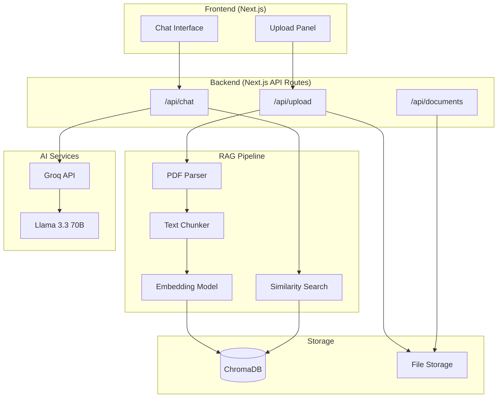

# Student Cohort RAG Chatbot MVP

Build a shared knowledge base and Q&A bot for Vlerick Business School Master's cohort.

---

## Architecture Overview



---

## Tech Stack Decision

| Component | Choice | Reasoning |
|-----------|--------|-----------|
| **Frontend** | Next.js 14 (App Router) | Full-stack, SSR, API routes built-in |
| **Styling** | Tailwind CSS | Rapid prototyping, mobile-first |
| **LLM** | Groq + Llama 3.3 70B | Generous free tier, extremely fast |
| **Embeddings** | HuggingFace (all-MiniLM-L6-v2) | Free, runs locally |
| **Vector DB** | ChromaDB | Free, simple, file-persistent |
| **PDF Parsing** | pdf-parse | Lightweight, no external deps |
| **Streaming** | Vercel AI SDK | Built-in streaming support |

> [!NOTE]
> All chosen services have generous free tiers. ChromaDB stores vectors locally, eliminating database costs.

---

## User Review Required

> [!IMPORTANT]
> **Password Protection**: I'll implement a simple shared password gate (environment variable). Anyone with the password can view and upload. Is this acceptable?

> [!IMPORTANT]
> **Groq API Key**: You'll need to get a free API key from [console.groq.com](https://console.groq.com). Want me to use a different provider?

---

## Proposed Changes

### Project Structure

```
vlerick-chatbot/
├── app/
│   ├── layout.tsx              # Root layout with fonts/metadata
│   ├── page.tsx                # Main chat page
│   ├── globals.css             # Tailwind + custom styles
│   └── api/
│       ├── chat/
│       │   └── route.ts        # Chat endpoint with streaming
│       ├── upload/
│       │   └── route.ts        # PDF upload + RAG indexing
│       └── documents/
│           └── route.ts        # List uploaded documents
├── components/
│   ├── ChatInterface.tsx       # Main chat container
│   ├── MessageBubble.tsx       # Individual message with citations
│   ├── ChatInput.tsx           # Input field with send button
│   ├── UploadPanel.tsx         # File upload with progress
│   ├── DocumentList.tsx        # Show indexed documents
│   └── PasswordGate.tsx        # Simple auth screen
├── lib/
│   ├── rag/
│   │   ├── vectorstore.ts      # ChromaDB initialization
│   │   ├── embeddings.ts       # Embedding generation
│   │   ├── chunker.ts          # Text chunking logic
│   │   └── retriever.ts        # Similarity search
│   ├── pdf-parser.ts           # PDF to text extraction
│   └── prompts.ts              # System prompts
├── public/
│   └── uploads/                # Stored PDF files
├── data/
│   └── chroma/                 # ChromaDB persistence
├── .env.local.example          # Environment template
├── package.json
├── tailwind.config.ts
└── README.md
```

---

### Core Features Implementation

#### [NEW] [app/page.tsx](file:///Users/canerden/.gemini/antigravity/scratch/vlerick-chatbot/app/page.tsx)
Main page with chat interface. Features:
- Password gate check
- Chat message history
- Streaming response display
- Responsive layout (mobile-first)

#### [NEW] [app/api/chat/route.ts](file:///Users/canerden/.gemini/antigravity/scratch/vlerick-chatbot/app/api/chat/route.ts)
Chat endpoint that:
1. Receives user query
2. Generates embedding for query
3. Retrieves top-k relevant chunks from ChromaDB
4. Injects context into system prompt
5. Streams response from Groq/Llama
6. Returns source citations

#### [NEW] [app/api/upload/route.ts](file:///Users/canerden/.gemini/antigravity/scratch/vlerick-chatbot/app/api/upload/route.ts)
Upload endpoint that:
1. Accepts PDF file
2. Parses PDF to text
3. Chunks text into ~500 token segments
4. Generates embeddings for each chunk
5. Stores in shared ChromaDB collection
6. Saves original file for reference

#### [NEW] [lib/rag/vectorstore.ts](file:///Users/canerden/.gemini/antigravity/scratch/vlerick-chatbot/lib/rag/vectorstore.ts)
ChromaDB setup with:
- Single shared collection ("vlerick-knowledge")
- Persistent storage in `data/chroma/`
- Metadata storage for source tracking

---

### System Prompt

```text
You are a helpful Vlerick Business School Teaching Assistant. Your role is to 
help students find information about their courses, exams, schedules, and 
school policies.

IMPORTANT RULES:
1. Answer questions using ONLY the context provided below
2. If the answer is not in the documents, say "I don't have that information 
   in the uploaded documents. Please check with your professor or the 
   Vlerick student portal."
3. Never make up or hallucinate information
4. Be concise but thorough
5. When relevant, mention which document the information came from

CONTEXT FROM UPLOADED DOCUMENTS:
{context}
```

---

## Verification Plan

### Automated Tests
```bash
# 1. Build succeeds
npm run build

# 2. Development server starts
npm run dev

# 3. API routes respond
curl http://localhost:3000/api/documents
```

### Manual Verification
1. Upload a test PDF → Verify it appears in document list
2. Ask a question about the PDF content → Verify relevant answer
3. Ask a question NOT in any document → Verify "I don't know" response
4. Test on mobile viewport → Verify responsive layout
5. Test streaming → Verify tokens appear progressively

---

## Environment Variables Needed

```env
# Required
GROQ_API_KEY=your_groq_api_key

# Optional (simple password protection)
APP_PASSWORD=vlerick2024

# Optional (for future Canvas integration)
# CANVAS_API_KEY=your_canvas_key
```

---

## Dependencies

```json
{
  "dependencies": {
    "next": "^14.2.0",
    "react": "^18.2.0",
    "ai": "^3.0.0",           // Vercel AI SDK for streaming
    "groq-sdk": "^0.5.0",     // Groq client
    "chromadb": "^1.8.0",     // Vector database
    "@xenova/transformers": "^2.17.0",  // Local embeddings
    "pdf-parse": "^1.1.1",    // PDF extraction
    "lucide-react": "^0.312.0"  // Icons
  }
}
```
